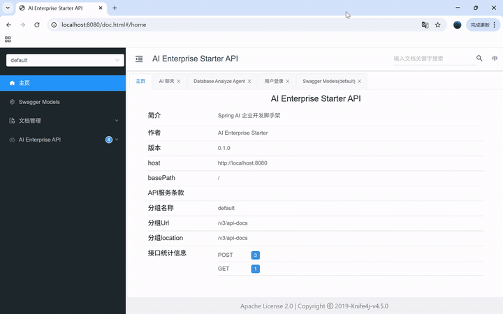
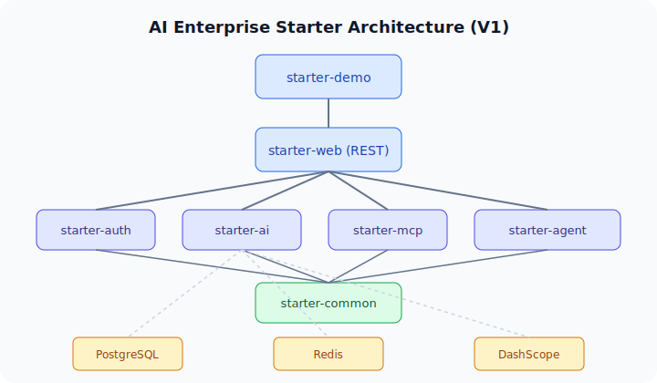
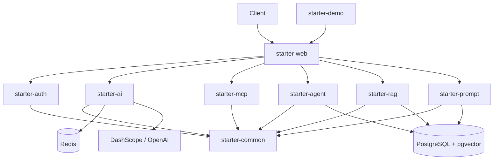

# AI Enterprise Starter

<p align="center">
  
</p>

<p align="center">
  <strong>让 Java 开发者 10 分钟拥有一个企业级 AI Agent 项目</strong>
</p>

<p align="center">
  开箱即用的 Spring AI 企业开发脚手架 — Chat · RAG · Prompt · MCP · Database Agent · Workflow · Agent Router · JWT · Docker
</p>

<p align="center">
  
</p>

## 功能特性

- Spring Boot 3.4 多模块脚手架
- Spring AI Chat（OpenAI 兼容，默认通义千问）
- **RAG 知识库**（txt/md/pdf/docx 上传 + pgvector 检索问答）
- **OCR 文档入库**（扫描 PDF / 图片 → DashScope OCR → RAG）
- **Prompt 管理**（多版本模板 + `{{var}}` 渲染，Chat/Agent/RAG 可配置）
- Database Analyze Agent（自动读取 Schema/索引并给出 SQL 优化建议）
- **Workflow 编排**（Java 原生步骤引擎，Database Agent 三步流水线 + 步骤追踪 API）
- **Multi-Agent Router**（混合路由：自动选择 Chat / RAG / Database Agent）
- JWT 认证、Redis 会话记忆
- PostgreSQL（pgvector）+ Redis + Docker Compose 一键启动
- Knife4j API 文档

## 快速启动

### 1. 克隆项目

```bash
git clone https://github.com/pysasuke/ai-enterprise-starter.git
cd ai-enterprise-starter
```

### 2. 配置 API Key

```bash
cp .env.example .env
```

编辑 `.env`：

```env
DASHSCOPE_API_KEY=sk-your-key
OPENAI_BASE_URL=https://dashscope.aliyuncs.com/compatible-mode
OPENAI_MODEL=qwen-plus
EMBEDDING_MODEL=text-embedding-v3
```

> base-url **不要**带 `/v1`，Spring AI 会自动拼接。

### 3. 一键启动

```bash
# 仅基础设施（PostgreSQL 使用 pgvector 镜像）
docker compose up -d postgres redis

# 构建并运行
mvn install -DskipTests
java -jar starter-demo/target/starter-demo-0.1.0-SNAPSHOT.jar
```

或完整 Docker（含应用）：

```bash
docker compose up -d
```

### 4. 访问

| 服务 | 地址 |
|------|------|
| API | http://localhost:8080 |
| Knife4j | http://localhost:8080/doc.html |
| 默认账号 | admin / admin123 |

### 5. 一键验收

```powershell
.\scripts\verify.ps1
```

## 架构

<p align="center">
  
</p>



## 核心 API

| 方法 | 路径 | 说明 |
|------|------|------|
| POST | `/api/chat` | AI 聊天 |
| GET | `/api/tools` | Tool 列表 |
| POST | `/api/agent/database` | Database Analyze Agent |
| POST | `/api/auth/login` | JWT 登录 |
| POST | `/api/rag/documents` | 上传知识库文档 |
| GET | `/api/rag/documents` | 文档列表 |
| POST | `/api/rag/chat` | RAG 知识库问答 |
| GET | `/api/prompts` | Prompt 定义列表 |
| POST | `/api/prompts/{key}/{type}/versions` | 创建 Prompt 新版本 |
| PUT | `/api/prompts/{key}/{type}/active` | 设置生效版本 |
| POST | `/api/prompts/render` | 预览模板渲染 |

示例见 [examples/api-examples.http](./examples/api-examples.http)、[examples/rag-examples.http](./examples/rag-examples.http)、[examples/prompt-examples.http](./examples/prompt-examples.http)、[examples/workflow-examples.http](./examples/workflow-examples.http)、[examples/agent-route-examples.http](./examples/agent-route-examples.http)

## RAG 快速体验

```bash
# 确保 Postgres 已启用 pgvector（首次升级需重建 volume）
docker compose down -v && docker compose up -d postgres redis

mvn install -DskipTests
# 加载 .env 后启动
java -jar starter-demo/target/starter-demo-0.1.0-SNAPSHOT.jar
```

```bash
# 上传示例文档
curl -F "file=@examples/refund-policy.md" http://localhost:8080/api/rag/documents

# RAG 问答
curl -X POST http://localhost:8080/api/rag/chat \
  -H "Content-Type: application/json" \
  -d '{"question":"退款政策是什么？","topK":5}'
```

## OCR 文档入库

扫描 PDF 或图片（png/jpg/webp）需开启 OCR（调用 DashScope **qwen3.5-ocr**，按次计费）：

```bash
# .env 中设置
OCR_ENABLED=true
# DASHSCOPE_API_KEY 与 Chat 共用

# 上传图片示例
curl -F "file=@examples/ocr-sample.png" http://localhost:8080/api/rag/documents
```

> 普通 PDF（可选中文字）仍走 PDFBox，不产生 OCR 费用。`verify.ps1` 支持 `-SkipOcr` 跳过 OCR 验收。

## Workflow 编排

Database Analyze 提供带步骤追踪的新端点（原 `/api/agent/database` 保持不变）：

```bash
curl -X POST http://localhost:8080/api/workflows/database-analyze \
  -H "Content-Type: application/json" \
  -d '{"question":"orders表按user_id查询为什么慢？"}'
```

响应包含 `analysis` 与 `steps[]`（每步 `name`、`status`、`durationMs`、`summary`）。任一步失败时 HTTP 400，仍返回已执行步骤的追踪信息。

示例见 [examples/workflow-examples.http](./examples/workflow-examples.http)。

## Agent Router（多 Agent 编排）

统一入口自动路由到 Chat / RAG / Database Agent（规则优先，LLM fallback）：

```bash
curl -X POST http://localhost:8080/api/workflows/agent-route \
  -H "Content-Type: application/json" \
  -d '{"question":"退款政策是什么？"}'
```

响应包含 `answer`、`selectedAgent`（`CHAT` / `RAG` / `DATABASE`）、`steps[]` 与可选 `metadata`（RAG 时含 `sources`）。

示例见 [examples/agent-route-examples.http](./examples/agent-route-examples.http)。

## Prompt 快速体验

应用启动后会自动 seed 默认 Prompt（`chat.system`、`database.agent`、`rag.chat`）。

```bash
# 列出 Prompt
curl http://localhost:8080/api/prompts

# 预览渲染
curl -X POST http://localhost:8080/api/prompts/render \
  -H "Content-Type: application/json" \
  -d '{"key":"database.agent","type":"user","variables":{"question":"为什么慢？","schema":"orders","indexes":"idx_id"}}'

# 创建新版本并设为生效
curl -X POST http://localhost:8080/api/prompts/database.agent/system/versions \
  -H "Content-Type: application/json" \
  -d '{"content":"你是数据库专家，只给优化建议。"}'
curl -X PUT http://localhost:8080/api/prompts/database.agent/system/active \
  -H "Content-Type: application/json" \
  -d '{"version":2}'
```

## 模块说明

| 模块 | 说明 |
|------|------|
| starter-common | Result、Exception、BaseEntity |
| starter-auth | JWT 登录、用户管理 |
| starter-ai | Chat、Prompt、Redis Memory |
| starter-mcp | MCP Tool 注册与列表 |
| starter-agent | Database Analyze Agent |
| starter-rag | RAG 知识库（解析、向量、问答） |
| starter-prompt | Prompt 版本管理与模板渲染 |
| starter-web | Controller、全局异常、Swagger |
| starter-demo | 启动入口 |

## 本地开发

```bash
docker compose up -d postgres redis
mvn install -DskipTests
mvn -pl starter-demo spring-boot:run
```

加载 `.env` 后启动（PowerShell）：

```powershell
Get-Content .env | ForEach-Object {
  if ($_ -match '^\s*([^#][^=]+)=(.*)$') {
    Set-Item -Path "env:$($matches[1].Trim())" -Value $matches[2].Trim()
  }
}
java -jar starter-demo/target/starter-demo-0.1.0-SNAPSHOT.jar
```

## 测试

```bash
mvn verify   # 单元测试（含 RAG、Prompt 模块）
```

## License

[Apache License 2.0](./LICENSE)
