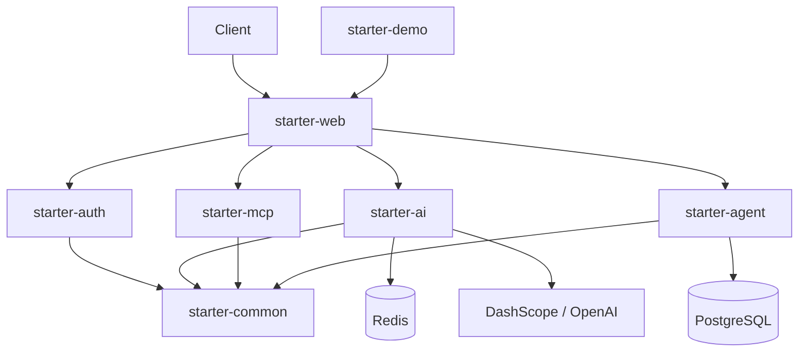

# AI Enterprise Starter

<p align="center">
  
</p>

<p align="center">
  <strong>让 Java 开发者 10 分钟拥有一个企业级 AI Agent 项目</strong>
</p>

<p align="center">
  开箱即用的 Spring AI 企业开发脚手架 — Chat · MCP · Database Agent · JWT · Docker
</p>

<p align="center">
  
</p>

## 功能特性（V1）

- Spring Boot 3.4 多模块脚手架
- Spring AI Chat（OpenAI 兼容，默认通义千问）
- Database Analyze Agent（自动读取 Schema/索引并给出 SQL 优化建议）
- JWT 认证、Redis 会话记忆
- PostgreSQL + Docker Compose 一键启动
- Knife4j API 文档

## 快速启动

### 1. 克隆项目

```bash
git clone https://github.com/your-org/ai-enterprise-starter.git
cd ai-enterprise-starter
```

### 2. 配置 API Key

```bash
cp .env.example .env
```

编辑 `.env`：

```env
DASHSCOPE_API_KEY=sk-your-key
OPENAI_BASE_URL=https://dashscope.aliyuncs.com/compatible-mode
OPENAI_MODEL=qwen-plus
```

> base-url **不要**带 `/v1`，Spring AI 会自动拼接。

### 3. 一键启动

```bash
# 仅基础设施
docker compose up -d postgres redis

# 构建并运行
mvn install -DskipTests
java -jar starter-demo/target/starter-demo-0.1.0-SNAPSHOT.jar
```

或完整 Docker（含应用）：

```bash
docker compose up -d
```

### 4. 访问

| 服务 | 地址 |
|------|------|
| API | http://localhost:8080 |
| Knife4j | http://localhost:8080/doc.html |
| 默认账号 | admin / admin123 |

### 5. 一键验收

```powershell
.\scripts\verify.ps1
```

## 架构

<p align="center">
  
</p>



## 核心 API

| 方法 | 路径 | 说明 |
|------|------|------|
| POST | `/api/chat` | AI 聊天 |
| GET | `/api/tools` | Tool 列表 |
| POST | `/api/agent/database` | Database Analyze Agent |
| POST | `/api/auth/login` | JWT 登录 |

示例见 [examples/api-examples.http](./examples/api-examples.http)

## 模块说明

| 模块 | 说明 |
|------|------|
| starter-common | Result、Exception、BaseEntity |
| starter-auth | JWT 登录、用户管理 |
| starter-ai | Chat、Prompt、Redis Memory |
| starter-mcp | MCP Tool 注册与列表 |
| starter-agent | Database Analyze Agent |
| starter-web | Controller、全局异常、Swagger |
| starter-demo | 启动入口 |

## 本地开发

```bash
docker compose up -d postgres redis
mvn install -DskipTests
mvn -pl starter-demo spring-boot:run
```

加载 `.env` 后启动（PowerShell）：

```powershell
Get-Content .env | ForEach-Object {
  if ($_ -match '^\s*([^#][^=]+)=(.*)$') {
    Set-Item -Path "env:$($matches[1].Trim())" -Value $matches[2].Trim()
  }
}
java -jar starter-demo/target/starter-demo-0.1.0-SNAPSHOT.jar
```

## 测试

```bash
mvn verify   # 32 个单元测试
```

## License

[Apache License 2.0](./LICENSE)
